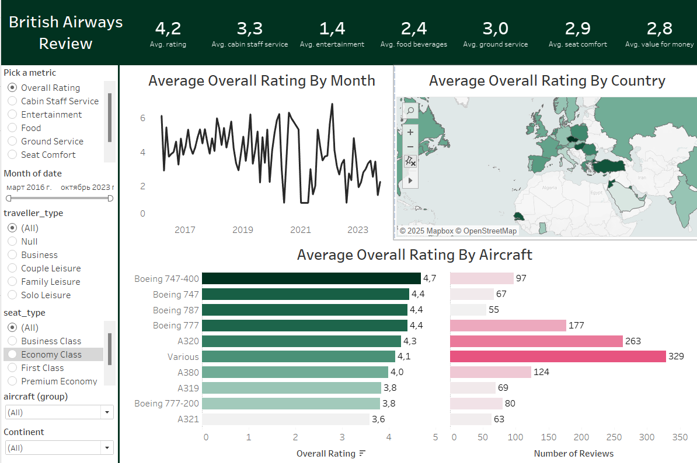
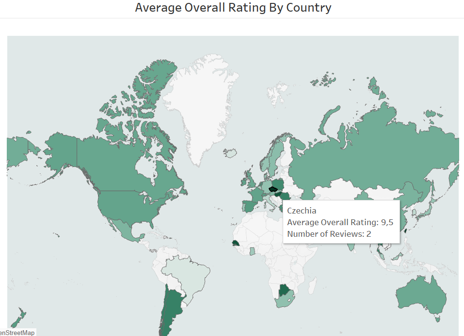
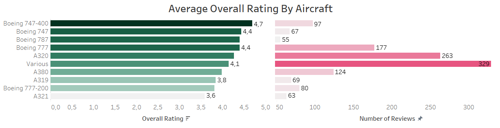
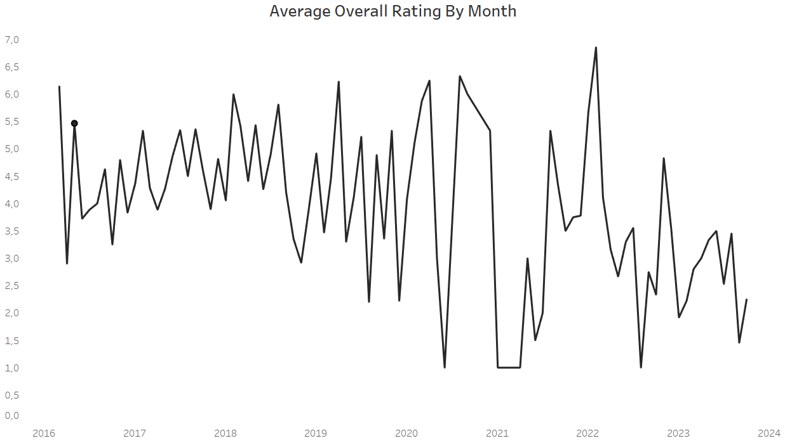

# Проект : British Airways 

## Обзор проекта

В рамках этого проекта анализируются отзывы клиентов British Airways (BA), чтобы оценить удовлетворенность пассажиров по различным факторам, включая качество обслуживания, комфорт, питание и развлечения. Проект сочетает анализ отзывов и оценок, чтобы на их основе получить релевантное представление о качестве обслуживания клиентов компании.

**Источники данных:** [ba_reviews.csv](https://github.com/Nina9876/DATA-ANALYST-PORTFOLIO/blob/main/Tableau%20British%20Airway%20Reviews%20Dashboard/ba_reviews.csv), [Countries.csv](https://github.com/Nina9876/DATA-ANALYST-PORTFOLIO/blob/main/Tableau%20British%20Airway%20Reviews%20Dashboard/Countries.csv).

**Цели:** Понять факторы, влияющие на удовлетворенность клиентов, и предоставить практическую информацию для улучшения обслуживания.

## Описание данных

В этом проекте используются данные отзывов клиентов о рейсах British Airways, а также данные о странах для глубокого анализа перспектив качества обслуживания. Набор данных включает подробные отзывы пассажиров о различных аспектах их перелета, таких как комфорт, качество питания и обслуживание клиентов. Эти данные позволяют всесторонне изучить факторы, влияющие на удовлетворенность клиентов, включая маршрут полета, тип путешественника и региональные особенности отзывов.

**1. Данные об отзывах клиентов**

  Этот файл включает информацию о:

  - Подробностях отзыва: текстовый отзыв, обобщающий впечатления рецензента.
  - Рейтинги: количественные оценки (по шкале от 1 до 5 баллов) по таким категориям, как комфортность сидения, развлечения в полете, еда и напитки, а также наземное обслуживание.
  - Информации о путешественниках: информация о демографических данных путешественников и подробная информация о рейсе: тип путешественника (бизнес, отдыхающий) и класс места (эконом, бизнес-класс).
  - Маршрут полета и модель воздушного судна: Конкретные траектории полета и тип используемого воздушного судна.

**2. Данные по странам**

  Эти данные позволяют сегментировать отзывы в зависимости от региона, обогощая анализ и облегчая понимание тенденций удовлетворенности по географическому положению. Ключевые поля включают:

  - Название и код страны: стандартизированная информация о стране для сопоставления с источниками отзывов.
  - Континент и регион: классификация для анализа региональных тенденций, позволяющая распределить удовлетворенность по континентам или регионам.

# Map Chart

 Наглядное представление данных в map chart позволяет быстро и эффективно оценить средний рейтинг по регионам. На этой картографической схеме показаны средние оценки по различным параметрам, таким как общий рейтинг, обслуживание персонала в салоне, развлечения, питание, наземное обслуживание, комфорт сидений и стоимость. 
 
 Всплывающие подсказки отображают среднюю оценку по каждому параметру и общее количество отзывов. На карте присутствуют цветовые градиенты, которые указывают на разные средние уровни оценки.
 
 

# Horizontal Bar Chart

Bar Charts в Tableau позволяют наглядно увидеть отзывы клиентов по каждому параметру. На этих диаграммах отображаются средние оценки по параметрам и количество отзывов по каждому типу самолета.

Расположение столбчатых диаграмм рядом друг с другом позволило быстро сравнить различные параметры и определить, какие типы воздушных судов получили самые высокие, а какие самые низкие средние оценки по каждому параметру. Это помогло подсветить области, в которых British Airways преуспела, а где напротив необходимы улучшения. 

# Line Chart

Line chart прекрасно отображает показатели по месяцам, что позволяет легко определить тенденции и сезонные закономерности в отзывах клиентов.

На этой линейной диаграмме показаны ежемесячные тенденции в отношении общего рейтинга, обслуживания персонала в салоне, развлечений, питания, наземного обслуживания, комфорта сидений и стоимости. все это дает четкое представление о том, как менялись эти показатели с 2016 по 2023 год.

# Summery:

Ключевые показатели сведены в одном месте, чтобы пользователи могли быстро определить сильные стороны для улучшения без необходимости навигации по нескольким диаграммам.
На панели представлены KPI общего рейтинга, обслуживания персонала в салоне, развлечений, питания, наземного обслуживания, комфорта сидений и стоимости.
Благодаря такому использованию ключевых показателей эффективности панель мониторинга становится мощным инструментом для получения полезной информации и повышения общего удобства пользователей.

# Рекомендации

## 1. Повышение качества обслуживания

  - Рекомендация: При средней оценке персонала в салоне 3,3/5, а наземного обсуживания 3/5, повышение качества обслуживания может повысить удовлетворенность, особенно в эконом-классе.
  - Меры: Регулярно проводите тренинги для персонала, уделяя особое внимание внимательности, эффективности и стандартам обслуживания.

## 2. Повышение комфортности сидений

  - Рекомендация: Средняя оценка комфорта сидений 2,9/5, повышение уровня комфорта в эконом-классе может значительно повысить общий рейтинг.
  - Действие: Приобретайте эргономичные сиденья с дополнительным пространством для ног и амортизацией, особенно на дальних маршрутах, где дискомфорт ощущается сильнее.

## 3. Улучшение питания

Рекомендация: Рейтинг качества блюд 2,4/5 указывает на необходимость улучшения меню, особенно в эконом-классе.
Действие: Старайтесь разнообразить меню и повысить качество, включите больше диетических блюд, веганских и безглютеновых.

## 4. Улучшение развлекательных программ в полете

Рекомендация: Поскольку рейтинг развлекательных программ составляет всего 1,4 из 5, модернизация системы развлечений в полете (IFE) имеет важное значение.
Действие: Переходите на сенсорные экраны и расширяйте ассортимент контента, включая региональные фильмы, интерактивные игры, собирайте отзывы о предпочтениях контента, чтобы убедиться, что опции IFE отвечают интересам самых разных пассажиров.

## Вывод:

Таким образом, услуги компании могут значительно улучшиться, если принять меры по повышению комфорта сидячих мест эконом-класса, качества питания и развлекательных предложений. Устранение этих факторов может значительно повысить удовлетворенность клиентов и сохранить лояльность пассажиров.

