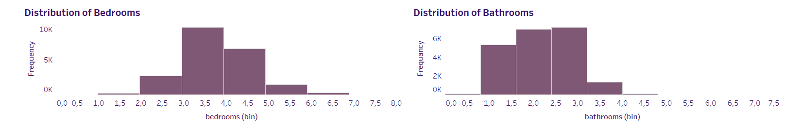
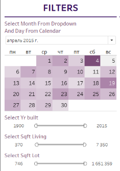

# King County House Sales

## Обзор проекта

В этом проекте использован набор данных о продажах домов в округе Кинг, штат Вашингтон, для анализа данных о недвижимости. Этот набор данных содержит информацию о более чем 21 000 домах на одну семью, проданных в округе Кинг, штат Вашингтон, в период с 2014 по 2015 год.

В проекте используются такие визуальные элементы как линейная диаграмма, гистограмма, карта и тепловая карта. В качестве основного фильтра создан виджет календаря. Дэшборд отличается функциональностью и удобством, фильтры можно настроить таким образом, чтобы посмотреть цены на жилье в зависимости от даты и года постройки, площади, средней цены за расположение, цены за состояние и вид, а также количество спален/ванных комнат.

# Data Visualizations and Analysis

## Line Plot

Линейный график отлично показывает динамику среднесуточных цен на дома. Этот график дает представление об общей активности на рынке и показывает динамику спроса и предложения с течением времени. Анализируя тенденции ежедневных продаж, мы можем определить периоды высокой и низкой активности при продаже жилья.

Максимальную среднюю цену мы можем наблюдать 27.05.2015 и она составляет 1 310 000.
Наименьший показатель за 15.02.2015 - 219 000.

## Map

Географическая карта это наглядное представление данных о продажах домов. Она позволяет определить географические закономерности в продажах, определить районы с более высокими или более низкими показателями продаж. Анализируя карту, мы можем получить представление о том, как местоположение, район проживания, близость и удобства влияют на цены на жилье.

На карте мы можем наблюдать, что в районе Eastland обычно продаются дома с самой высокой стоимостью 1 145 200.
В районах на окраине как правило самая низкая цена, в Auburn мы можем наблюдать минимальную стоимость в 234 284, что отличается от максимальной почти в 5 раз.

## Histogram

Гистограмма показывает распределение цен на жилье и помогает определить диапазон цен. Эта информация важна для понимания общей доступности жилья и рентабельности инвестиций в данной местности.
Наиболее часто встречающаяся цена на жилье 283 000. Диапазон же варьируется от 71 000 (23 предложения) до 1 488 000 (3 предложения).

Гистограмма спроса по количествам спален показывает нам демографические различия в каждом районе.

Гистограмма распределения ванных комнат позволяет дать оценку функциональности объектов недвижимости. Анализируя распределение, мы можем определить районы с более высокой концентрацией домов с большим количеством ванных комнат, которые могут понравиться многодетным семьям.

## Heatmap

Тепловая карта дает возможность наиболее быстро ориентироваться в большом количестве информации за счет цветового окраса. В проекте тепловая карта рынка недвижимости представляет собой зависимость цены дома от вида и состояния объекта. Есть 5 видов оценки состояние дома: бедное, потрепанное, среднее, хорошее и очень хорошее. Вид можно оценить как: отличный, хороший, средний, скудный, без вида.

Самые дорогие дома находятся в хорошем состояние и с отличным видом, их средняя стоимость 1 014 091.
Самое доступное жилье это жилье в плохом состояние и без вида, его можно приобрести в среднем за 287 438.

# Filters anad vidgets

  На боковой панели находятся фильтры и виджеты для сортировки данных:

  - Календарный виджет
  - Фильтр по году постройки
  - Фильтр по площади жилого помещения
  - Фильтр по общей площади 

