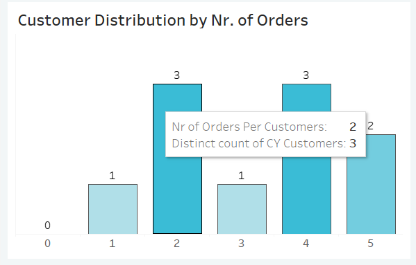

# Sales and Customers Dashboards

## Обзор проекта

Проект выполнен в Tableau и предназначен для анализа данных о клиентах и продажах. Он визуализирует данные и состоит из двух дэшбордов: sales dashboard и customers dashboard.

Цель Sales dashboard - предоставить обзор показателей и тенденций продаж, чтобы проанализировать показатели продаж за год и понять тенденции продаж.

Customer dashboard предоставляет обзор данных о клиентах, тенденций и поведений. Это помогает маркетинговым командам и руководству понять потребительские сегменты, чтобы повысить удовлетворенность клиентов.

В проекте используется четыре набора данных для создания визуализаций.

## Базы данных

В проекте используются следующие базы данных:

  - Customers: Информация о клиентах.

  - Location: Географические данные, относящиеся к продажам.

  - Orders: Подробные сведения о заказах на продажу.

  - Products: Информация о проданных продуктах.

# Customer Dashboard

## KPI and Customer trends

KPI Overview :  Отображает сводную информацию об общем количестве клиентов, общем объеме продаж на одного клиента и общем количестве заказов за текущий и предыдущий год.

Customer Trends : Отображает данные по каждому ключевому показателю эффективности по месяцам как за текущий, так и за предыдущий год. Определяет месяцы с самыми высокими и самыми низкими продажами. А всплывающее окно демонстрирует показатели текущего и прошлого года в числовом и процентном эквиваленте.

Мы можем наблюдать, что количество клиентов за год увеличилось на 8,6%, объем продаж на одного клиента возрос на 10,8%, а общее количество заказов увеличилось на 28,3%, что дает нам представление о положительной динамике развития компании.

В ноябре 2023 был пик количества клиентов и заказов, а в октябре 2023 был самый высокий объем продаж на клиента.

№№ Customer Distribution by Number of Orders

Показывает данные о распределение клиентов в зависимости от количества заказов. Это позволяет получить представление о поведении клиентов, их лояльности и вовлеченности.
Мы можем наблюдать, что большинство людей делают 2-4 заказа.

## Top 10 Customers By Profit

Рейтинг показывает топ 10 клиентов, которые принесли компании наибольшую прибыль. А также предоставляет дополнительную информацию о клиентах: ранк, количество заказов, текущие продажи, текущая прибыль и дата последнего заказа.

